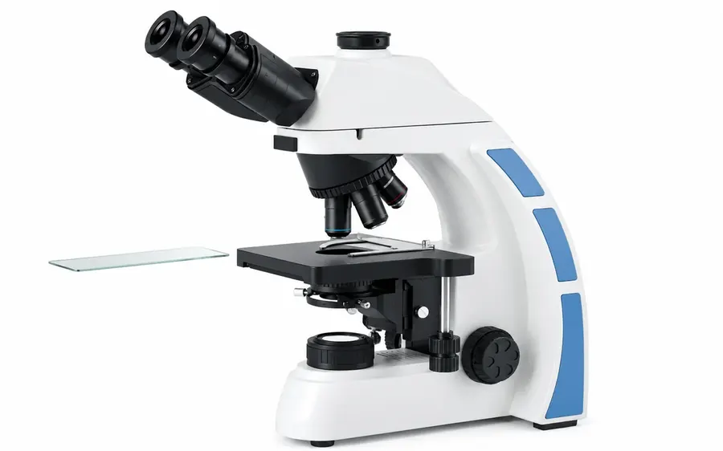
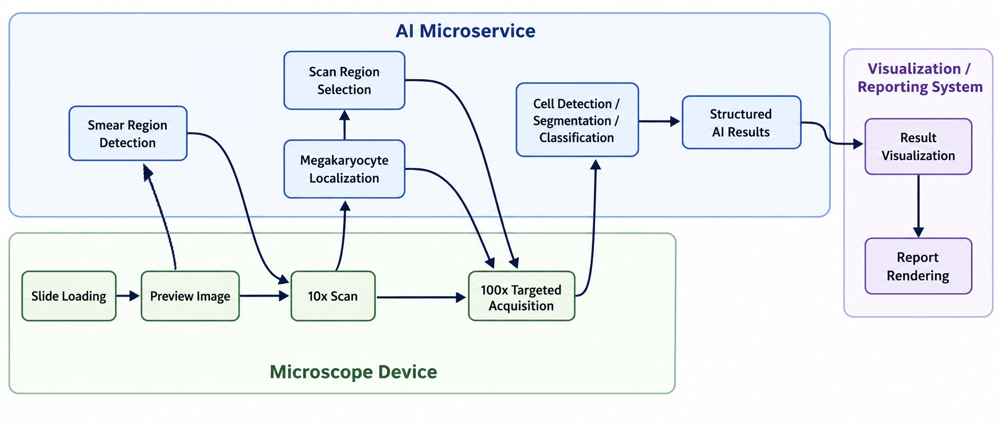

# AI-Powered Hematology Morphology Analysis System

  

> Portfolio case study of AI modules developed for a commercial hematology morphology analysis platform.  
> This repository does not contain proprietary source code, model weights, patient data, or internal product documents.

## Overview

This repository presents a portfolio case study of the AI system I led for a commercial hematology morphology analysis platform. Manual morphology review of peripheral blood and bone marrow smears is time-consuming and depends heavily on expert experience. The system was designed to support automated smear analysis by combining microscope scanning, image-based region selection, cell detection, segmentation, classification, and structured AI outputs for downstream visualization and reporting.

Unlike a standalone image classification task, this system works as part of an automated microscope workflow. Low-magnification preview and 10x scanning are used to identify suitable regions, while 100x images are acquired for detailed cell-level analysis. The AI modules not only analyze captured images but also help guide where the device should scan next.

The AI components were deployed as microservices and integrated with the device-side scanning workflow, enabling the system to return scan-region decisions, cell-level predictions, and morphology analysis results to the downstream visualization and reporting system.

## System Workflow

The system uses a coarse-to-fine workflow:

1. A blood smear or bone marrow smear slide is loaded into the device.
2. A preview image is captured to identify the smear region.
3. A 10x scan is performed to locate candidate regions.
4. The selected coordinates are sent to the device-side control system.
5. The microscope acquires high-resolution 100x images from selected regions.
6. AI models perform cell detection, segmentation, and classification.
7. Structured AI analysis results are submitted to the visualization/reporting system for review and report rendering.

  

## AI Modules

### 1. Smear Region Detection

The system first analyzes low-magnification preview images to identify the valid smear area and determine where scanning should be performed.

### 2. Megakaryocyte Analysis

At 10x magnification, the AI module localizes candidate megakaryocyte regions and sends their coordinates to the device. The device then acquires 100x images for further megakaryocyte segmentation and 4-class classification.

### 3. Blood Cell Region Selection

For blood cell analysis, the system uses 10x images to select suitable regions for 100x acquisition based on white blood cell distribution, red blood cell density, and smear quality.

### 4. High-Magnification Cell Analysis

On 100x images, the AI system performs cell-level analysis, including

| Cell type | AI task |
|---|---|
| White blood cells | Detection / segmentation / 15-class classification |
| Red blood cells | Detection / morphology analysis / 10-class classification |
| Platelets | Detection / segmentation / 4-class classification |
| Megakaryocytes | Localization at 10x / segmentation at 100x / 4-class classification |

## Performance and Deployment Optimization
To improve throughput, the pipeline was organized as a multi-task system, allowing independent modules to run in parallel where possible. The deployment pipeline also used model compression, knowledge distillation, and TensorRT optimization to reduce inference latency while maintaining the required model accuracy.

Improved AI analysis throughput from approximately **10 images per second to 20 images per second** through model compression and TensorRT-based optimization. After optimization, AI inference was no longer the main bottleneck, with overall processing speed primarily limited by the microscope image acquisition workflow.

## Data Scale
The project involved **over 200,000 annotated cell instances**, including white blood cells, red blood cells, platelets, and megakaryocytes.

## My Involvement

I led the AI work from early-stage design to product delivery. Beyond model development, my work included understanding clinical morphology workflows, collecting product requirements, translating user needs into AI features, planning data collection and annotation, optimizing deployment, and integrating AI services with the device-side scanning system.

Main areas I worked on:

- translated clinical and customer requirements into AI functions;
- designed the coarse-to-fine workflow from slide preview and 10x scanning to 100x cell-level analysis;
- planned and managed multi-category cell data collection and annotation;
- led model development for region selection, cell detection, segmentation, and classification;
- deployed AI modules as microservices and optimized inference with model compression, knowledge distillation, and TensorRT;
- led a 4-person AI team and communicated with clinical users to refine product requirements.